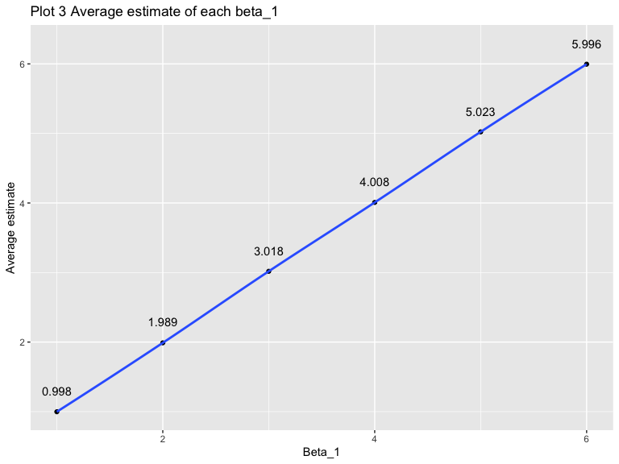

p8105\_hw5\_xw2676
================

## Problem 1

``` r
set.seed(10)
iris_with_missing = iris %>% 
  map_df(~replace(.x, sample(1:150, 20), NA)) %>%
  mutate(Species = as.character(Species)) 

## create a function

replace_missing_value = function(x) {
   if (is.numeric(x)) {
    a = mean(x, na.rm = TRUE) %>% 
      round(digit = 2)
    x = replace_na(x, a)
  }else if (is.character(x)) {
    x = replace_na(x, "virginica")
  }
   x
}

## apply the function to columns of dataset

iris_modified = as.tibble(map(iris_with_missing, replace_missing_value))

## example of the dataset
head(iris_modified,3)
```

    ## # A tibble: 3 x 5
    ##   Sepal.Length Sepal.Width Petal.Length Petal.Width Species
    ##          <dbl>       <dbl>        <dbl>       <dbl> <chr>  
    ## 1          5.1         3.5          1.4         0.2 setosa 
    ## 2          4.9         3            1.4         0.2 setosa 
    ## 3          4.7         3.2          1.3         0.2 setosa

## Problem 2

``` r
filename = list.files("./data/problem2") %>% 
  as.tibble() 

file_base = "./data/problem2/"

path = vector("list", length = 20)
for (i in 1:20) {
  path[i] = str_c(file_base, filename[i,1])
}

con_exp = map(path, read_csv)

## create a dataframe containing data from all participants, including the subject ID, arm, and observations over time.

arm_df = filename %>% 
  mutate(
    data = con_exp
  ) %>% 
  unnest() %>% 
  separate(value, into = c("arm","subject_ID"), sep = "_") %>% 
  mutate(
    subject_ID = str_replace(subject_ID, ".csv","")
  ) %>% 
  pivot_longer(
    3:10,
    names_to = "week",
    names_prefix = "week_"
  ) %>% 
  mutate(
    arm = as.factor(arm),
    subject_ID = as.factor(subject_ID),
    week = as.factor(week)
  )

## An example of the dataframe.

head(arm_df, 3)
```

    ## # A tibble: 3 x 4
    ##   arm   subject_ID week  value
    ##   <fct> <fct>      <fct> <dbl>
    ## 1 con   01         1      0.2 
    ## 2 con   01         2     -1.31
    ## 3 con   01         3      0.66

``` r
## generate a plot of value in each week of each subject with different arms.

ggplot(arm_df, aes(x = week, y = value, color = subject_ID, group = subject_ID)) +
  geom_line() +
  facet_grid(~arm) +
  labs(
    title = "Plot 1 Value in each week of each subject",
    x = "Week",
    y = "Value"
  ) 
```


From the plots above, we can see that there is a overall rise of the
value observed in the experiment group, and there is no trend in control
group.

## Problem 3

``` r
## create a function 
set.seed(10)
sim_regression = function(n = 30, beta0 = 2, beta1) {
  
  sim_data = tibble(
    x = rnorm(n, mean = 0, sd = 1),
    y = beta0 + beta1 * x + rnorm(n, 0, sd = sqrt(50))
  )
  
  ls_fit = lm(y ~ x, data = sim_data)
  broom::tidy(ls_fit) %>% 
  filter(term == "x") %>% 
  select(estimate, p.value)
}

## apply the function 

results = rerun(10000, sim_regression(30, 2, 0)) %>% 
  bind_rows()

## An example of the results

head(results, 3)
```

    ## # A tibble: 3 x 2
    ##   estimate p.value
    ##      <dbl>   <dbl>
    ## 1   -2.44   0.0895
    ## 2   -0.366  0.769 
    ## 3    2.10   0.0917

``` r
set.seed(10)
output = vector("list", length = 6)
for (i in c(1,2,3,4,5,6)) {
  output[[i]] = rerun(10000, sim_regression(beta1 = i))
  output[[i]] = bind_rows(output[[i]])
}

sim_results = 
  tibble(beta_1 = c(1, 2, 3, 4, 5, 6)) %>% 
  mutate(
    output = output) %>% 
    unnest(output) %>% 
  mutate(
    result = ifelse(p.value < 0.05, "reject", "accept")
  ) 

data_reject = sim_results %>% 
  group_by(beta_1, result) %>% 
  summarise(n = n()) %>% 
  pivot_wider(
    names_from = result,
    values_from = n
  ) %>% 
  mutate(
    total = accept + reject,
    reject_rate = reject/total
  )

ggplot(data_reject, aes(x = beta_1, y = reject_rate)) +
  geom_point() +
  labs(
    title = "Plot 2 Rejection proportion",
    x = "Beta_1",
    y = "Rejection proportion"
  ) +
　geom_text(aes(y = reject_rate + 0.03, label = reject_rate)) +
  geom_smooth(se = FALSE)
```

    ## `geom_smooth()` using method = 'loess' and formula 'y ~ x'


``` r
average_data = sim_results %>% 
  group_by(beta_1) %>% 
  summarise(
    mean = round(mean(estimate),3)
  )
```

We can see from Plot 1 that the proportion of times the null was
rejected increases with the effect size increases, which means that when
effect size increases, the power of the test increases.

``` r
ggplot(average_data, aes(x = beta_1, y = mean)) +
  geom_point() +
  labs(
    title = "Plot 3 Average estimate of each beta_1",
    x = "Beta_1",
    y = "Average estimate"
  ) +
　geom_text(aes(y = mean + 0.3, label = mean)) +
  geom_smooth(se = FALSE)
```

    ## `geom_smooth()` using method = 'loess' and formula 'y ~ x'



``` r
reject_average_data = sim_results %>% 
  filter(result == "reject") %>% 
  group_by(beta_1) %>% 
  summarise(
    mean = round(mean(estimate),3)
  )

ggplot(reject_average_data, aes(x = beta_1, y = mean)) +
  geom_point() +
  labs(
    title = "Plot 4 Average estimate that are rejected of each beta_1 ",
    x = "Beta_1",
    y = "Average estimate"
  ) +
　geom_text(aes(y = mean + 0.2, label = mean)) +
  geom_smooth(se = FALSE)
```

    ## `geom_smooth()` using method = 'loess' and formula 'y ~ x'


The sample average of beta\_1 across tests for which the null is
rejected is not equal to the true value of beta\_1. Because only when
its value is far away from the true value, then it can be rejected. So
when the effect size is small, the proportion of rejection is small, so
the average will be a little larger than the true value. When the effect
size is large, then the proportion of rejection is large, so the average
will be approximately equal to the true value.
