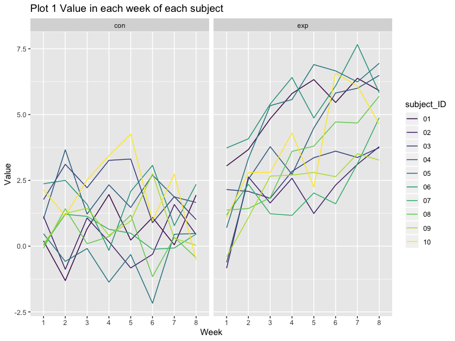
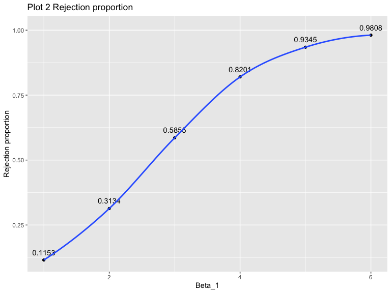

p8105\_hw5\_xw2676
================

## Problem 1

``` r
iris_with_missing = iris %>% 
  map_df(~replace(.x, sample(1:150, 20), NA)) %>%
  mutate(Species = as.character(Species)) 

replace_missing_value = function(x) {
   if (is.numeric(x)) {
    a = mean(x, na.rm = TRUE)
    x = replace_na(x, a)
  }else if (is.character(x)) {
    x = replace_na(x, "virginica")
  }
   x
}

iris_modified = as.tibble(map(iris_with_missing, replace_missing_value))
```

## Problem 2

``` r
filename = list.files("./data/problem2") %>% 
  as.tibble() 

file_base = "./data/problem2/"

file_con_exp = vector("list", length = 20)
for(i in 1:20) {
  file_con_exp[i] = str_c(file_base, filename[i,1])
}

con_exp = map(file_con_exp, read_csv)

arm_df = filename %>% 
  mutate(
    data = con_exp
  ) %>% 
  unnest() %>% 
  separate(value, into = c("arm","subject_ID"), sep = "_") %>% 
  mutate(
    subject_ID = str_replace(subject_ID, ".csv","")
  ) %>% 
  pivot_longer(
    3:10,
    names_to = "week",
    names_prefix = "week_"
  ) %>% 
  mutate(
    arm = as.factor(arm),
    subject_ID = as.factor(subject_ID),
    week = as.factor(week)
  )

ggplot(arm_df, aes(x = week, y = value, color = subject_ID, group = subject_ID)) +
  geom_line() +
  facet_grid(~arm)
```

<!-- -->

From the plots above, we can see that there is a overall rise of the
value observed in the experiment group, and there is no trend in control
group.

## Problem 3

``` r
sim_regression = function(n = 30, beta0 = 2, beta1) {
  
  sim_data = tibble(
    x = rnorm(n, mean = 0, sd = 1),
    y = beta0 + beta1 * x + rnorm(n, 0, sd = sqrt(50))
  )
  
  ls_fit = lm(y ~ x, data = sim_data)
  broom::tidy(ls_fit) %>% 
  filter(term == "x") %>% 
  select(estimate, p.value)
}

results = rerun(10000, sim_regression(30, 2, 0)) %>% 
  bind_rows()
```

``` r
output = vector("list", length = 6)
for (i in c(1,2,3,4,5,6,7)) {
  output[[i]] = rerun(10000, sim_regression(beta1 = i - 1))
  output[[i]] = bind_rows(output[[i]])
}

sim_results = 
  tibble(beta_1 = c(0, 1, 2, 3, 4, 5, 6)) %>% 
  mutate(
    output = output) %>% 
    unnest(output) %>% 
  mutate(
    result = ifelse(p.value < 0.05, "reject", "accept")
  ) %>% 
  group_by(beta_1, result) %>% 
  summarise(n = n()) %>% 
  pivot_wider(
    names_from = result,
    values_from = n
  ) %>% 
  mutate(
    total = accept + reject,
    reject_rate = reject/total
  )

ggplot(sim_results, aes(x = beta_1, y = reject_rate)) +
  geom_line()
```

<!-- -->
